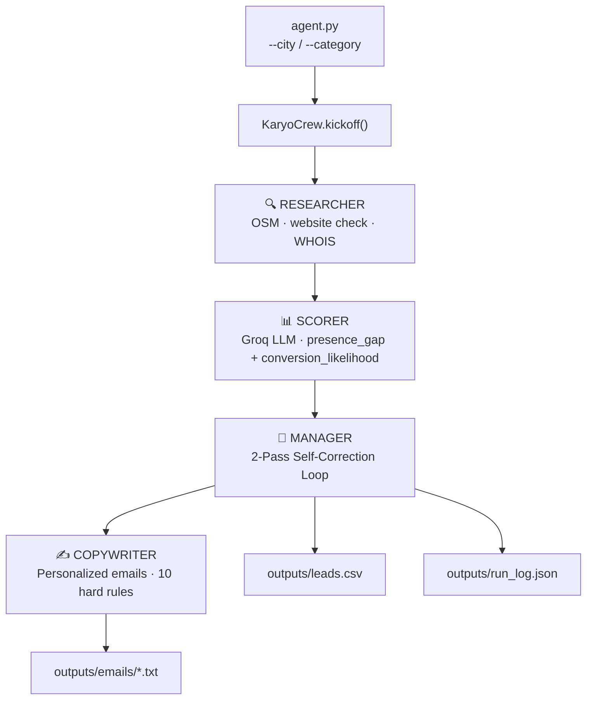

# KĀRYO Lead Intelligence Agent

Multi-agent AI system for local business lead generation — built for **Agentathon 2026**.

Given a city and business category, KĀRYO autonomously discovers local businesses, scores them on digital-presence gaps, runs a self-correcting decision loop, and writes personalized cold outreach emails — all in one terminal command.

---

## Problem

Digital agencies and freelancers who offer web design or online marketing spend hours manually searching Google Maps, checking websites, and writing pitches for every prospect. There is no scalable tool that discovers, qualifies, and pre-writes outreach for local business leads.

---

## Solution

```bash
python agent.py --city "Indiranagar" --category "dentists"
```

KĀRYO runs a 4-agent pipeline that takes ~10 seconds and produces:
- A ranked CSV of approved leads with scores
- One personalized cold email per lead (100–140 words, citing specific gaps)
- A full audit trail of every decision

---

## Agent Architecture



### The 4 Agents

**Researcher** — queries OpenStreetMap (free, no API key) to find businesses, checks website health (HTTP status, SSL, response time), and looks up domain age via WHOIS. Builds a `BusinessDossier` per business.

**Scorer** — sends each dossier to Groq `llama-3.3-70b-versatile` with a rubric:
- **Presence Gap Score (1–10):** no website (+4), dead website (+3), no SSL (+1), no Instagram (+1)...
- **Conversion Likelihood (1–10):** low review count (+2), high rating (+1), young domain (+1)...
- Combined score out of 20 → flagged `approve` (≥16), `reject` (≤8), or `borderline` (9–15)

**Manager (2-Pass Self-Correction)** — the most novel component:
- *Pass 1:* clear decisions instantly (approve/reject)
- *Pass 2:* for borderline leads, generates a targeted research question via Groq, re-researches the business, re-scores, and approves at a lower threshold (≥13) — rewarding the extra evidence
- Every decision logged to `run_log.json` with timestamp, scores, and full reasoning

**Copywriter** — generates a personalized email per approved lead with 10 hard rules enforced via LLM system prompt (word count 100–140, subject references the specific gap, no clichés, cites dossier fields verbatim). Word count is validated and retried automatically.

---

## Stack

| Tool | Purpose |
|---|---|
| **CrewAI** | Agent orchestration (hierarchical process) |
| **Groq** `llama-3.3-70b-versatile` | Scoring, Manager follow-up queries, email generation |
| **OpenAI** `gpt-4o-mini` | Automatic fallback |
| **Pydantic v2** | Data models & validation |
| **diskcache** | Persistent SQLite-backed cache for all external calls |
| **Rich** | Terminal UI |
| **OpenStreetMap** | Business discovery (Nominatim + Overpass API) |
| **Python-WHOIS** | Domain age lookup |

---

## Outputs

| File | Description |
|---|---|
| `outputs/leads.csv` | Approved leads with full score breakdown |
| `outputs/emails/<name>.txt` | Personalized cold email per lead |
| `outputs/run_log.json` | Full decision audit trail with timestamps |

---

## Sample Output

```
Subject: Devaki Dental Clinic's Online Visibility Gap

Hi Devaki Dental Clinic,

Your dental clinic in Indiranagar lacks a website and online reviews, making it
hard for patients to find and trust you. Zero reviews means no social proof when
patients research you, and there's no phone number listed anywhere online.

KĀRYO Digital helps dental clinics like yours build a strong online presence
through custom websites and targeted marketing.

Would a 15-min call this week work?

Best,
Karan & Havinash
KĀRYO Digital, Bangalore
```

---

## Quick Start

```bash
# 1. Install dependencies
uv sync

# 2. Configure credentials
cp .env.example .env
# Add GROQ_API_KEY at minimum

# 3. Run
python agent.py --city "Indiranagar" --category "dentists"
```

**Stub mode:** If no API keys are set, the pipeline runs with deterministic stub data so you can verify the full scaffold end-to-end immediately.

**Cache-only demo mode:** Set `KARYO_CACHE_ONLY=1` for an instant offline demo run using pre-cached data (5–8 seconds).

---

## Impact & Scalability

- Works for **any city** and any OpenStreetMap business category (dentists, gyms, restaurants, lawyers...)
- OpenStreetMap has global coverage — no geographic lock-in
- Caching means repeat runs on the same city are instant and cost $0
- Outputs integrate directly with email automation tools (Mailchimp, Instantly, etc.)

A freelancer can run this every morning and have 5 warm, scored, pre-written leads ready before their first coffee.

---

## Smoke Test

```bash
python tests/smoke_test.py
```

---

## Author

**Karan Raj KR** — Solo project, Agentathon 2026

Full documentation: [`docs/submission_doc.md`](docs/submission_doc.md)
Architecture diagram: [`docs/architecture.md`](docs/architecture.md)
