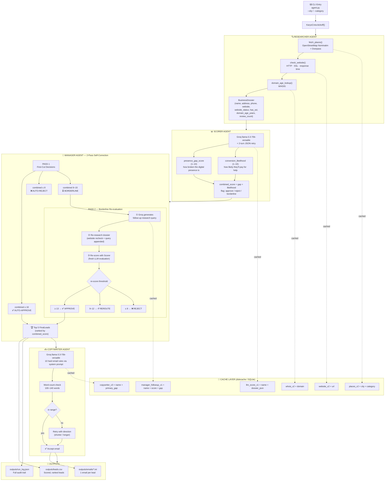

# KĀRYO Agent Architecture

## System Flowchart



---

## Decision Thresholds

```
PASS 1                          PASS 2
──────────────────────          ──────────────────────
combined ≥ 16 → APPROVE         re-score ≥ 13 → APPROVE
combined ≤ 8  → REJECT          re-score ≤ 8  → REJECT
combined 9–15 → BORDERLINE →→→  re-score 9–12 → REROUTE
                (enters Pass 2)
```

The lower Pass 2 threshold (13 vs 16) **rewards the extra research effort** — a borderline lead that survives re-evaluation has earned its approval.

---

## Data Flow Summary

```
CLI args
  └─▶ Researcher ──▶ list[BusinessDossier]
         └─▶ Scorer ──▶ list[LeadScore]  (flag: approve/reject/borderline)
               └─▶ Manager
                     ├─ Pass 1 → clear decisions
                     └─ Pass 2 → re-research + re-score borderlines
                           └─▶ list[FinalLead]  (top 5)
                                 └─▶ Copywriter ──▶ dict[name → email]
                                       └─▶ Write outputs
                                             ├─ leads.csv
                                             ├─ emails/*.txt
                                             └─ run_log.json
```
