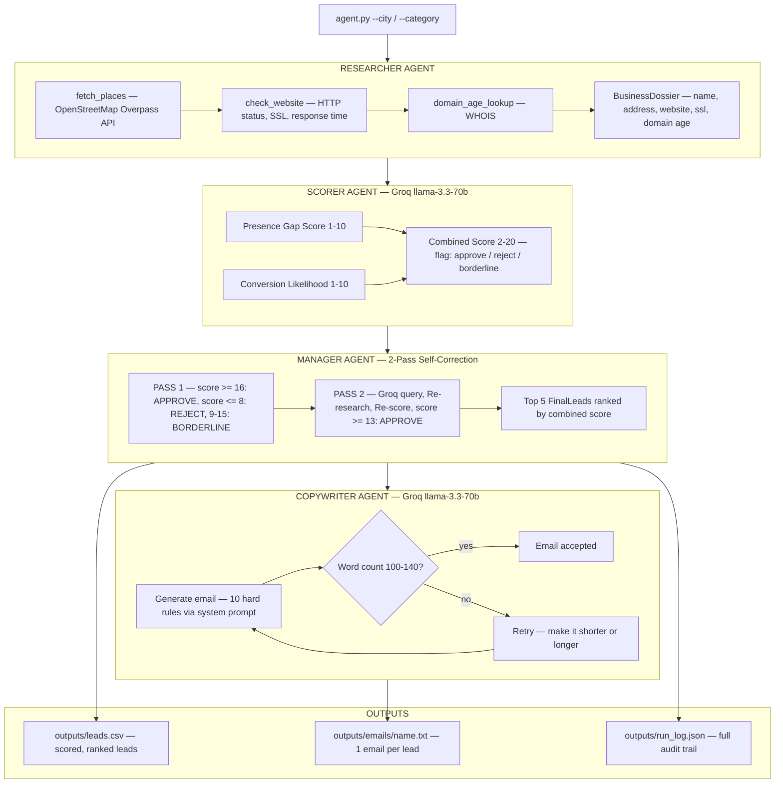
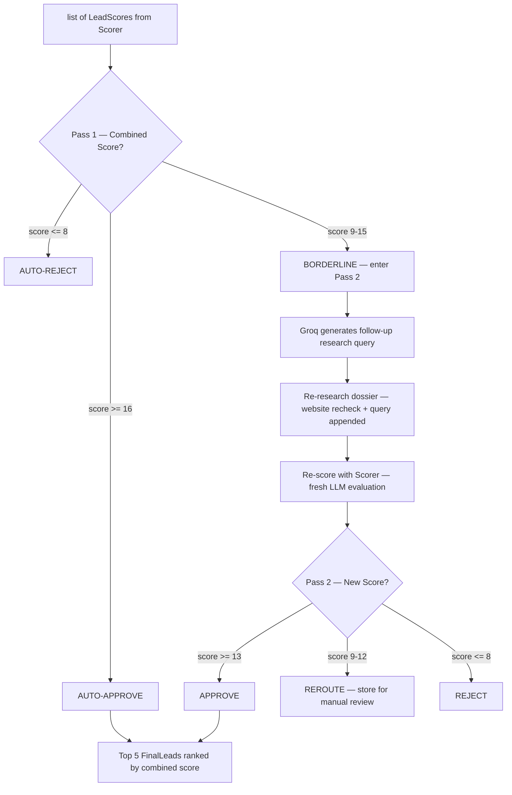

# KĀRYO Agent Architecture

## Main Pipeline


```mermaid
flowchart TD
    CLI["agent.py  --city / --category"]

    subgraph RESEARCHER["RESEARCHER AGENT"]
        R1["fetch_places — OpenStreetMap Overpass API"]
        R2["check_website — HTTP status, SSL, response time"]
        R3["domain_age_lookup — WHOIS"]
        R4["BusinessDossier — name, address, website, ssl, domain age"]
        R1 --> R2 --> R3 --> R4
    end

    subgraph SCORER["SCORER AGENT — Groq llama-3.3-70b"]
        S1["Presence Gap Score 1-10"]
        S2["Conversion Likelihood 1-10"]
        S3["Combined Score 2-20 — flag: approve / reject / borderline"]
        S1 --> S3
        S2 --> S3
    end

    subgraph MANAGER["MANAGER AGENT — 2-Pass Self-Correction"]
        M1["PASS 1 — score >= 16: APPROVE, score <= 8: REJECT, 9-15: BORDERLINE"]
        M2["PASS 2 — Groq query, Re-research, Re-score, score >= 13: APPROVE"]
        M3["Top 5 FinalLeads ranked by combined score"]
        M1 --> M2 --> M3
    end

    subgraph COPYWRITER["COPYWRITER AGENT — Groq llama-3.3-70b"]
        CW1["Generate email — 10 hard rules via system prompt"]
        CW2{"Word count 100-140?"}
        CW3["Email accepted"]
        CW4["Retry — make it shorter or longer"]
        CW1 --> CW2
        CW2 -- yes --> CW3
        CW2 -- no --> CW4 --> CW1
    end

    subgraph OUTPUTS["OUTPUTS"]
        O1["outputs/leads.csv — scored, ranked leads"]
        O2["outputs/emails/name.txt — 1 email per lead"]
        O3["outputs/run_log.json — full audit trail"]
    end

    CLI --> RESEARCHER
    RESEARCHER --> SCORER
    SCORER --> MANAGER
    MANAGER --> COPYWRITER
    MANAGER --> O1
    MANAGER --> O3
    COPYWRITER --> O2
```

---

## Manager 2-Pass Decision Logic


```mermaid
flowchart TD
    IN["list of LeadScores from Scorer"]

    IN --> P1{"Pass 1 — Combined Score?"}
    P1 -- "score >= 16" --> A1["AUTO-APPROVE"]
    P1 -- "score <= 8" --> R1["AUTO-REJECT"]
    P1 -- "score 9-15" --> BL["BORDERLINE — enter Pass 2"]

    BL --> Q["Groq generates follow-up research query"]
    Q --> RR["Re-research dossier — website recheck + query appended"]
    RR --> RS["Re-score with Scorer — fresh LLM evaluation"]

    RS --> P2{"Pass 2 — New Score?"}
    P2 -- "score >= 13" --> A2["APPROVE"]
    P2 -- "score 9-12" --> RO["REROUTE — store for manual review"]
    P2 -- "score <= 8" --> R2["REJECT"]

    A1 --> TOP["Top 5 FinalLeads ranked by combined score"]
    A2 --> TOP
```

---

## Caching

Every external call is cached to disk (diskcache / SQLite). Second run on the same city + category is instant.

| Call | Cache Key |
|---|---|
| OSM places search | `places_v2 + city + category` |
| Website health check | `website_v2 + url` |
| WHOIS domain age | `whois_v2 + domain` |
| LLM score | `llm_score_v1 + name + dossier_json` |
| Manager follow-up query | `manager_followup_v1 + name + score + gap` |
| Copywriter email | `copywriter_v3 + name + primary_gap` |

Set `KARYO_CACHE_ONLY=1` for an instant offline demo run (raises on any cache miss).

---

## Data Flow Summary

```
agent.py
  └─► Researcher ──► list[BusinessDossier]
        └─► Scorer ──► list[LeadScore]  (approve / reject / borderline)
              └─► Manager
                    ├─ Pass 1: clear decisions
                    └─ Pass 2: re-research + re-score borderlines
                          └─► list[FinalLead]  (top 5)
                                ├─► leads.csv
                                ├─► run_log.json
                                └─► Copywriter ──► emails/*.txt
```
