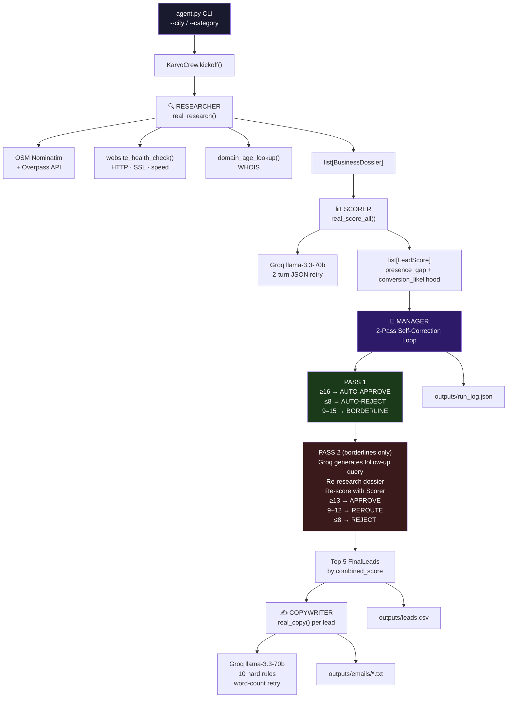

# KĀRYO Lead Intelligence Agent
### Technical Project Documentation — Agentathon 2026

---

## 1. Project Title

**KĀRYO Lead Intelligence Agent**

A multi-agent AI system that autonomously discovers, qualifies, and writes personalized outreach for local business leads — transforming hours of manual prospecting into a 10-second terminal command.

---

## 2. Team Composition

| Name | Role |
|---|---|
| **Karan Raj KR** | Solo — Agent Architecture, Backend Engineering, Prompt Engineering, Tool Integration, Terminal UI |

---

## 3. Problem Statement

Digital agencies and freelancers who offer website design, SEO, or online marketing services face a brutal bottleneck: finding the right businesses to pitch. The ideal prospect is a local business that has a physical presence but lacks a digital one — no website, dead domain, no SSL, zero reviews. Finding these manually means hours of Google Maps scrolling, tab-switching, and copy-pasting into spreadsheets, followed by writing personalized cold emails from scratch for each prospect.

There is no tool that does this end-to-end autonomously. Existing lead generation tools are either too generic (B2B SaaS databases like Apollo) or too manual (just exporting Google Maps results). None of them score leads on digital-presence gaps or write hyper-personalized outreach grounded in what the tool actually found.

**KĀRYO solves this.** Given a city and business category, it runs a full pipeline in under 10 seconds: discover → research → score → decide → write. The result is a ranked CSV of approved leads and ready-to-send personalized cold emails — all without a single human click.

---

## 4. Solution Overview

KĀRYO is a 4-agent orchestrated system built on CrewAI with a direct Python pipeline. A single CLI command triggers the full workflow:

```bash
python agent.py --city "Indiranagar" --category "dentists"
```

**What happens autonomously:**

1. **Discover** — Queries OpenStreetMap's Overpass API to find 15–25 local businesses matching the category. No API key required.
2. **Research** — For each business, checks website reachability (HTTP status, SSL certificate, response time) and domain age (WHOIS). Builds a structured `BusinessDossier` per business.
3. **Score** — Sends each dossier to Groq's `llama-3.3-70b-versatile` LLM with a precise rubric. Returns two scores: Presence Gap (how broken the digital presence is) and Conversion Likelihood (how likely they'll pay for help). Combined score out of 20.
4. **Decide** — The Manager agent applies a 2-pass self-correction loop. Clear leads are approved or rejected immediately. Borderline leads get a Groq-generated follow-up research question, are re-researched, re-scored, and re-evaluated at a lowered approval threshold.
5. **Write** — The Copywriter agent generates a 100–140 word personalized cold email for each approved lead, citing the specific gaps found in the dossier. Hard rules enforced via LLM system prompt with a word-count retry loop.

**Outputs written automatically:**
- `outputs/leads.csv` — scored, ranked approved leads
- `outputs/emails/<name>.txt` — one personalized email per lead
- `outputs/run_log.json` — full audit trail with timestamps and decision reasoning

**Caching system:** Every external call (OSM, WHOIS, website checks, LLM responses) is cached to disk. Second run on the same city/category completes in 5–8 seconds.

---

## 5. Agent Architecture

### System Diagram



---

### Agent 1: Researcher

**Role:** Discover and build a rich digital profile for each local business.

**Tools used:**
| Tool | Data Source | What it captures |
|---|---|---|
| `fetch_places()` | OpenStreetMap Overpass API | Name, address, phone, website URL |
| `check_website()` | Direct HTTP requests | Status (alive/dead/slow), SSL, response time |
| `get_domain_age()` | Python-WHOIS library | Years since domain registration |

**Output — `BusinessDossier`:**
```
name, place_id, address, phone, website, website_status,
has_ssl, domain_age_years, google_rating, review_count,
research_notes (3–5 structured observations)
```

The Researcher uses **real tool calls only** — no LLM, fully deterministic, completely cacheable.

---

### Agent 2: Scorer

**Role:** Evaluate each business on two dimensions using LLM reasoning grounded in a precise rubric.

**LLM:** Groq `llama-3.3-70b-versatile` with structured JSON output. Includes a 2-turn correction retry if the JSON is malformed.

**Scoring Rubric:**

**Presence Gap Score (1–10):** How broken is their digital presence?
- No website at all: +4
- Website is dead/unreachable: +3
- Website is slow (>3s): +2
- No SSL certificate: +1
- No Instagram: +1
- Base: 1

**Conversion Likelihood (1–10):** How likely are they to pay for help?
- Review count < 50 (still growing): +2
- Google rating ≥ 4.0 (cares about reputation): +1
- Domain age < 5 years (still building): +1
- Has phone number listed: +1
- Base: 1

**Combined Score = Presence Gap + Conversion Likelihood (range: 2–20)**

**Flagging:**
- combined ≥ 16 → `approve`
- combined ≤ 8 → `reject`
- 9–15 → `borderline` (sent to Manager Pass 2)

---

### Agent 3: Manager (2-Pass Self-Correction Loop)

**Role:** Make final approve/reject decisions with a self-correction mechanism for uncertain leads.

This is the most architecturally novel component.

**Pass 1 — First-Cut Decisions:**
- Score ≥ 16: instant `APPROVE`
- Score ≤ 8: instant `REJECT`
- Score 9–15: deferred to Pass 2

**Pass 2 — Borderline Self-Correction (3 steps):**

1. **Generate follow-up query** — Calls Groq with the business dossier and asks: *"What is the single most important thing to verify about this lead?"* Returns a one-sentence targeted question (e.g., "Is this business actively seeking an online presence?").

2. **Re-research** — Appends the follow-up query to the dossier's `research_notes`, re-runs the cached website check to confirm current status.

3. **Re-score** — Sends the enriched dossier back through the Scorer. New dossier → different cache key → fresh LLM evaluation.

**Pass 2 Decision (lower threshold — rewards the extra research effort):**
- Re-score ≥ 13: `APPROVE`
- Re-score 9–12: `REROUTE` (store follow-up for manual review)
- Re-score ≤ 8: `REJECT`

**Final output:** Top 5 approved leads ranked by combined score, as `FinalLead` objects.

Every decision is logged to `run_log.json` with timestamp, pass number, score breakdown, and full reasoning text.

---

### Agent 4: Copywriter

**Role:** Write a personalized, high-converting 100–140 word cold email for each approved lead.

**LLM:** Groq `llama-3.3-70b-versatile` with a strict 10-rule system prompt.

**Hard Rules (enforced via prompt, validated in code):**
1. Body word count must be 100–140 (validated after generation; retries with correction direction if violated)
2. Subject line must reference a specific gap or business name
3. Line 1 must name `primary_gap` verbatim
4. Lines 2–3 must reference at least one other dossier field (review_count, website_status, has_ssl, phone)
5. Final line must be exactly: *"Would a 15-min call this week work?"*
6. Forbidden phrases: "I noticed", "reaching out", "hope this finds you", "digital landscape", "in today's world", etc.
7. No emojis
8. Tone: peer-to-peer, direct, warm — not salesy

**Word-count retry loop:**
```python
email = call_groq(prompt)
wc = word_count(email)
if not (100 <= wc <= 140):
    email = call_groq(prompt + f"Body is {wc} words. Rewrite to be {'shorter' if wc>140 else 'longer'}.")
```

**Caching:** Cache key = `business_name + primary_gap` → same gap type = same email template across runs.

---

### Data Models (Pydantic v2)

```python
BusinessDossier  # Researcher output — raw business intel
LeadScore        # Scorer output — scores, flag, reasoning
ManagerDecision  # Manager output — action, reason, follow_up_query
FinalLead        # Combined: dossier + score + manager_reason
```

All models use strict Pydantic v2 validation and `.model_dump()` for JSON serialization.

---

### Caching Architecture

Every external call is cached to disk via `diskcache` (SQLite-backed, thread-safe):

| Layer | Cache Key | Effect |
|---|---|---|
| OSM places search | `places_v2 + city + category` | Same city never re-queried |
| Website health check | `website_v2 + url` | Same URL never re-checked |
| WHOIS age | `whois_v2 + domain` | Same domain never re-looked-up |
| LLM scores | `llm_score_v1 + name + dossier_json` | Same dossier never re-scored |
| Manager follow-up | `manager_followup_v1 + name + score + gap` | Same business never re-queried |
| Copywriter email | `copywriter_v3 + name + primary_gap` | Same gap type = cached email |

**Demo mode:** Set `KARYO_CACHE_ONLY=1` — the pipeline raises on any cache miss, guaranteeing a fully offline, instant demo run using only pre-cached data.

---

## 6. Tech Stack

| Layer | Tool / Framework | Purpose |
|---|---|---|
| **Agent Orchestration** | CrewAI ≥0.80.0 | Multi-agent crew, hierarchical process, task management |
| **Primary LLM** | Groq `llama-3.3-70b-versatile` | Scoring, Manager follow-up queries, email generation |
| **Fallback LLM** | OpenAI `gpt-4o-mini` | Automatic fallback if Groq key unavailable |
| **Data Validation** | Pydantic v2 | All data models, JSON schema enforcement |
| **Caching** | diskcache (SQLite) | Persistent disk cache for all external calls |
| **Terminal UI** | Rich | Colored panels, live decision output, summary tables |
| **Business Discovery** | OpenStreetMap Nominatim + Overpass API | Free, no API key, global coverage |
| **Website Analysis** | Requests + BeautifulSoup4 | HTTP health check, SSL detection, response time |
| **Domain Age** | Python-WHOIS | Domain registration date lookup |
| **Config** | python-dotenv | Environment variable management |
| **Package Manager** | uv | Fast Python dependency management |
| **Python** | 3.11–3.13 | Runtime |

---

## 7. Sample Output

### Generated Email — Devaki Dental Clinic

```
Subject: Devaki Dental Clinic's Online Visibility Gap

Hi Devaki Dental Clinic,

Your dental clinic in Indiranagar lacks a website and online reviews, making it
hard for patients to find and trust you. Zero reviews means no social proof when
patients research you, and there's no phone number listed anywhere online, which
can lead to missed appointments and lost patients. This gap in your online
presence can also make it difficult for new patients to discover your clinic.

KĀRYO Digital helps dental clinics like yours build a strong online presence
through custom websites and targeted marketing. We can help you establish a
professional website and improve your online visibility, making it easier for
patients to find and contact you.

Would a 15-min call this week work?

Best,
Karan & Havinash
KĀRYO Digital, Bangalore
```

### leads.csv — Sample Row

```csv
name,presence_gap_score,conversion_likelihood,combined_score,primary_gap,flag,manager_reason
Supriya Dental Clinic,9,6,15,No website,approve,"APPROVE after re-research: 15/20 ≥ 13. Significant presence gap — no website, no phone, zero reviews. Strong conversion potential."
```

---

## 8. Execution Demo

```
$ python agent.py --city "Indiranagar" --category "dentists"

╔════════════════════════════════════════════════════════╗
║        KĀRYO Lead Intelligence Agent                   ║
║        Agentathon 2026 — multi-agent lead generation   ║
╚════════════════════════════════════════════════════════╝

City: Indiranagar   Category: dentists

[ Researcher ]  Discovering businesses via OpenStreetMap...
  ✓ 20 businesses found, dossiers built

[ Scorer ]  Scoring 20 businesses with Groq LLM...
  Presence Gap: 4–9/10 | Conversion: 3–6/10

[ Manager ]  Pass 1 — first-cut decisions
  ✗ REJECT  Ivory Dental Care        (8/20 — below threshold)
  ✗ REJECT  Dental Care Centre       (8/20)
  ... 7 more rejections

[ Manager ]  Pass 2 — re-researching 11 borderline leads
  ↺ REROUTE → Research query: "Is this business actively seeking an online presence?"
  ✓ APPROVE  Dr.Paul's Dental Healthcare  (14/20 after re-research)
  ✓ APPROVE  Supriya Dental Clinic        (15/20)
  ... 8 more approvals

[ Copywriter ]  Generating personalized emails for top 5 leads...

┌─────────────────────────────────────────────────────┐
│ Final Leads                                         │
│  1. Supriya Dental Clinic       15/20  No website   │
│  2. Devaki Dental Clinic        14/20  No website   │
│  3. Dr.Paul's Dental Healthcare 14/20  No website   │
│  4. Mascot Speciality Dental    14/20  No website   │
│  5. Remuka Deltal Clinic        14/20  No website   │
└─────────────────────────────────────────────────────┘

leads.csv → outputs/leads.csv
5 email(s) → outputs/emails/
Mode: live | 5 approved lead(s) | run_log → outputs/run_log.json
```

---

## 9. Impact & Scalability

**Who benefits:**
- Freelancers and digital agencies targeting local businesses for web design, SEO, or digital marketing services
- Sales teams that need pre-qualified, pre-researched outreach lists

**Why it scales:**
- Works for **any city** and **any OpenStreetMap business category** (dentists, restaurants, gyms, salons, lawyers...)
- OpenStreetMap has global coverage — no geographic lock-in
- Caching means repeat runs on the same city cost $0 and run instantly
- The same pipeline can be extended to any business type by changing the category argument
- Outputs are ready for direct integration with email automation tools (Mailchimp, Instantly, etc.)

**Real-world usage:**
A freelance web developer can run `python agent.py --city "Koramangala" --category "gyms"` every morning and have 5 warm, scored, pre-written leads ready before their first coffee. No spreadsheets. No copy-paste. No generic templates.

**Current run (Indiranagar dentists):**
- 20 businesses discovered
- 9 auto-rejected (score ≤ 8/20)
- 11 borderlines re-researched and re-scored
- 5 highest-converting leads approved with personalized emails
- Full audit trail in `run_log.json`
